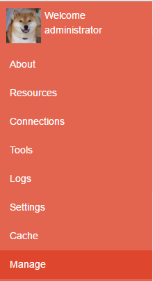
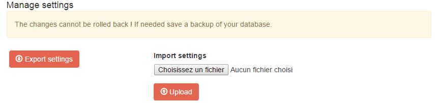

Getting Started
===============

In this part we are going to present the most important features and how to quickly secure an API.

.. contents:: Sections:
  :local:
  :depth: 1

If the application has been installed with Docker then jump to the next section :ref:`Install the Visual Studio extension <install-visualstudio-extension>`
otherwise continue.

Launch SimpleIdentityServer / IdentityServer
--------------------------------------------

Normally two shortcuts have been added to your Desktop : *Launch-IdServer.cmd* and *Launch-SimpleIdentityServer.cmd*.
The difference between both is the OpenId Provider. Indeed you can choose between our implementation *SimpleIdentityServer* or `IdentityServer4`_.
To help you making a decision, you can read the :doc:`Benchmark <benchmark>`.

.. image:: shortcuts.png
  :width: 50px

.. _install-visualstudio-extension:

Install the Visual Studio Extension
-----------------------------------

A Visual Studio Extension is available and can be downloaded here. It provides some useful features and thanks to it
any developers can easily protect an API and create client without requiring strong knowledge in OpenId, Uma and OAUTH2.0.

.. attention:: Unfortunately the tool is working only with Visual Studio 2015, ASP.NET CORE projects and C# projects.
               Previous versions and other languages will be supported in future releases.

Once it has been installed, create an empty project and display its contextual menu. You'll see two new items in it :

.. image:: vs-items.png
  :width: 150px

* The first-one *Generate security proxy* generates C# functions into the selected project.
  They are called by a client / API consumer to retrieve an RPT token. This one is passed into an HTTP Request Header
  to access to a protected resource.
* The second option *Generate resource(s)* displays the API operations of the selected project.
  The developer selects some operations to protect and submits his choice by clicking on "Protect".
  At the end the resources are automatically created based on a naming convention.

In the next sections we will run the second Scenario that consists to call a protected API via an API.
Fetch the GitHub project https://github.com/thabart/SimpleIdentityServer.Samples.git into a new directory named "Samples"
and open the Visual Studio solution "Scenario2/MarketingClient.sln"

Protect the operation
---------------------

Select the project "ClientApi" and display its contextual menu.
Click on the item *Generate resource(s)* and wait some minutes before the list is displayed.
Select the operation "ClientsController/Get" and click on protect.

.. image:: protected-clients.png
  :width: 200px

Now the resource has been added, its permissions can be edited via the website.

Add permission
--------------

Browse the `URL`_ and submit the following credentials in the login page.
If they are correct then you'll see more options in the left panel::

   Login: administrator
   Password: password

Click on **manage** and import the settings file. It contains all the assets that you need to run the different examples.

Click on **resources** and navigate to the folder *Apis > ClientApi > v1 > ClientsController*.
Display the contextual menu of the resource *Get* and click on **Permissions**.
In the new window add a new rule and persist the changes by executing the following actions :

1. Under allowed clients select *Scenario2*
2. Select the permissions *read, write, execute*
3. Click on **add rule**
4. Persist the changes by clicking on **save**

Execute the application
-----------------------

.. _URL: http://localhost:4200
.. _IdentityServer4: https://github.com/IdentityServer/IdentityServer4
