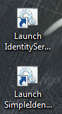
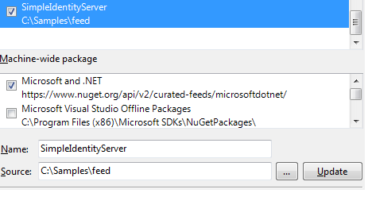
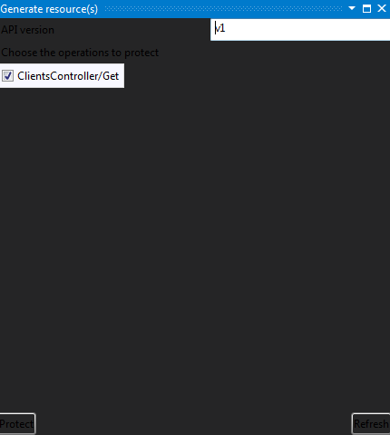

Getting Started
===============

In this part we are going to present the most important features and how to quickly secure an API.

.. contents:: Sections:
  :local:
  :depth: 1

If the application has been installed with Docker then jump to the next section :ref:`Install the Visual Studio extension <install-visualstudio-extension>`
otherwise continue to the next one.

Launch SimpleIdentityServer / IdentityServer
--------------------------------------------

Normally two shortcuts have been added to your Desktop : *Launch-IdServer.cmd* and *Launch-SimpleIdentityServer.cmd*.
The difference between both is the OpenId Provider. Indeed you can choose between our implementation *SimpleIdentityServer* or `IdentityServer4`_.
To help you making a decision, you can read the :doc:`Benchmark <benchmark>`.

.. _install-visualstudio-extension:

Install the Visual Studio Extension
-----------------------------------

A Visual Studio Extension is available and can be downloaded `here <https://github.com/thabart/SimpleIdentityServer/releases/download/1.0.0/SimpleIdentityServer.Vse.vsix>`_.
It provides some useful features and thanks to it any developers can easily protect an API and create client without requiring strong knowledge in OpenId, Uma and OAUTH2.0.

.. attention:: Unfortunately the tool is working only with Visual Studio 2015, ASP.NET CORE and C# projects.
               Previous versions and other languages will be supported in future releases.

Once it has been installed, create an empty project and display its contextual menu. You'll see two new items in it :

* The first-one **Generate security proxy** generates C# functions into the selected project.
  They are called by a client / API consumer to retrieve an RPT token. This one is passed into an HTTP Request Header
  to access to a protected resource.
* The second option **Generate resource(s)** displays the API operations of the selected project.
  The developer selects some operations to protect and submits his choice by clicking on **Protect**.
  At the end the resources are automatically created based on a naming convention.

In the next sections we will run the second Scenario that consists to call a protected API via an API.
Fetch the GitHub project https://github.com/thabart/SimpleIdentityServer.Samples.git into a new directory named "Samples".

Add Nuget feed & open the solution
----------------------------------

Download the `zip file <https://github.com/thabart/SimpleIdentityServer/releases/download/1.0.0/Feed.zip>`_ and extract its content into a new directory named *Feed*.
Start a new Visual Studio instance and add this folder as a new Nuget feed.
To do that open the *Package Sources* window by clicking on **Tools > Options > Nuget Package Manager > Package sources**.
Fill-in the field **name** with SimpleIdentityServer and specify the full path of the feed as **source**.
At the end you should obtain something like :

Still on the same Visual Studio instance, open the solution "Samples/Scenario2/MarketingClient.sln",
restore the Nuget packages and build the solution.
You are now ready to run the solution !

Protect the operation
---------------------

Select the project "ClientApi" and display its contextual menu.
Click on the item **Generate resource(s)** and wait some minutes before the list is displayed.
Select the operation "ClientsController/Get" and click on **Protect**.

Now the resource has been added, its permissions can be edited via the website.

Add permission
--------------

Browse the `URL of the website`_ and submit the following credentials.
If they are correct then you'll see more options in the left panel::

   Login: administrator
   Password: password

.. image:: images/left-panel.png
     :width: 180px

Download the `zip file <https://github.com/thabart/SimpleIdentityServer/releases/download/1.0.0/Exports.zip>`_
which contains all the settings and extract its content into a new folder named *Settings*.
Click on **manage** and import one of them depending on your OpenId Provider nature :

* SimpleIdentityServer : import *Settings / export-simpleidserver.json*
* IdentityServer: import *Settings / export-idserver.json*

.. image:: images/import.png
     :width: 350px

Click on **resources** and navigate to the folder *Apis > ClientApi > v1 > ClientsController*.
Display the contextual menu of the resource *Get* and click on **Permissions**.
In the new window add a new rule and persist the changes by executing the following actions :

1. Under allowed clients select *Scenario2*
2. Select the permissions *read, write, execute*
3. Click on **add rule**
4. Persist the changes by clicking on **save**

At the end you should obtain something like this :

.. image:: images/add-scenario2-rule.png
     :width: 350px

Execute the application
-----------------------

In the solution explorer set *ClientApi* and *MarketingClient* as startup projects and run them by pressing **F5**.
Open the URL http://localhost:5103/api/ratings with your preferred browser.
The list of clients should be returned by the API :

.. image:: images/scenario2-result.png
     :width: 350px

.. _URL of the website: http://localhost:4200
.. _IdentityServer4: https://github.com/IdentityServer/IdentityServer4
