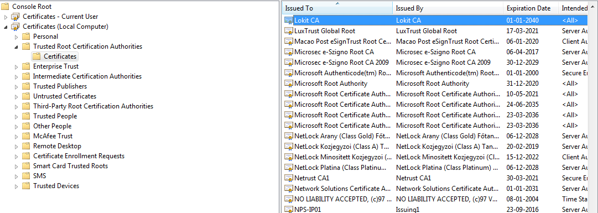

Install the certificate
=======================

.. role:: red-bold
.. raw:: html

    

The certificate :download:`LokitCA.cer <../../download/LokitCA.crt>` must be added to your certificate store **Local Computer \ Trusted CA**.

1. Execute the **mmc.exe** tool
2. Click on the menu item **File \ Add Remove snap in ...**
3. Below the available snap-ins select the **certificates** item and click on the **add** button
4. In the new window named **certificates snap-in** select the option **computer account** and click on **next** and **finish**
5. In the tree view located in the left panel, select the node **Console Root > Certificates (Local Computer) > Trusted Root Certification Authorities > Certificates**
6. Click on **more actions > all tasks > import ...**
7. In the new window named **certificate import wizard** select the certificate which has been downloaded and click on **Next**, **Next** and **Finish**

.. attention:: If you don't have a valid certificate installed on your machine then the website will not work and an error :red-bold:`NOT TRUSTED CERTIFICATE` will be displayed in your console.
  However it's still possible to work without it and to do that the certificate validation must be disabled in your favorite browser. It's a very dangerous step then don't leave the certificate validation disabled too long !
  Refer to the documentation below :
   - **Internet Explorer** : http://windowsitpro.com/windows/disabling-internet-explorer-feature-checks-server-certificate-revocation
   - **Google Chrome** : chrome://flags/#remember-cert-error-decisions
   - **FireFox** :http://smallbusiness.chron.com/disable-firefox-rejecting-certificates-59249.html
