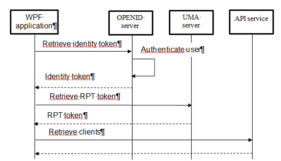
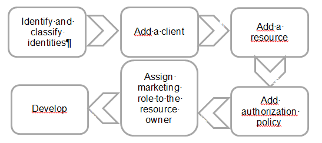
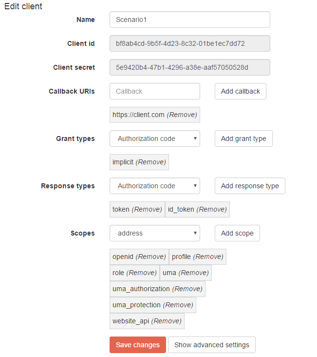
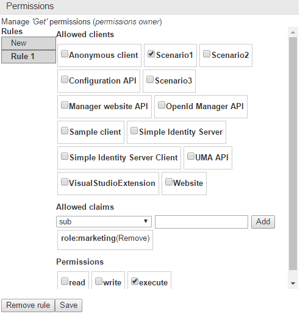
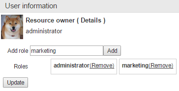

=======================================================
A heavy application wants to access to a protected API
=======================================================

.. role:: underline
.. raw:: html

    

.. role:: green
.. raw:: html

    

.. role:: red
.. raw:: html

    

.. contents:: Sections:
  :local:
  :depth: 3

-------
Context
-------

An e-commerce enterprise has internally developed a tool used by his marketing team to retrieve information
about his most loyal clients. The application has been developed in WPF and interact with a RESTFUL API to retrieve the clients.
:underline:`Only this application and users that belong to the marketing group are authorized to view the list`.

-------
Problem
-------

How the application can access to the protected operation ?

--------
Solution
--------

The workflow is made of three big steps

* **Identity token** : retrieve an identity token with `implicit grant type <http://openid.net/specs/openid-connect-implicit-1_0.html>`_.
  The token is returned to the client as a callback parameter.
* **RPT token** : the identity and access tokens (valid for the scope *uma_authorization*) are passed in the request
  to retrieve the `RPT one <https://docs.kantarainitiative.org/uma/rec-uma-core.html#rfc.section.3.5.1>`_.
  When it is received by the WPF application, the token is passed in the Authorization header to retrieve the loyal clients. Both parameters
  are required by the authorization policy.
* **Check RPT token**: the token is checked against the `introspection endpoint <https://docs.kantarainitiative.org/uma/rec-uma-core.html#rfc.section.3.4.1>`_,
  this one is offered by the UMA server.

We spared you the implementation details, otherwise it will be too much difficult to understand.
The workflow is normally much more complex and contains more intermediate steps.

Before going further, we are going to prepare the environment by following the steps :

Identify and classify identities
================================

The decision table can help you to identify and classify the identities :

+-------------------------------------------------+-----------------------------------------+
| Questions                                       | Type                                    |
+=================================================+=========================================+
| | Which application wants to access             | | Client                                |
| | to the resource ?                             |                                         |
+-------------------------------------------------+-----------------------------------------+
| | Which operation do-you want to protect ?      | | Concatenation of service name,        |
| | Identify the service name, his version,       | | version number, business entity,      |
| | the business entity (client, product)         | | and operation                         |
| | and the operation                             |                                         |
+-------------------------------------------------+-----------------------------------------+
| | Which applications are authorized             | | Authorized clients                    |
| | to access ?                                   |                                         |
+-------------------------------------------------+-----------------------------------------+
| | Which resource owner information              | | Claims                                |
| | are accepted ?                                |                                         |
+-------------------------------------------------+-----------------------------------------+

Result :

* **Client**: WPF application
* **Resource**: ClientApi / v1 / Clients / Get
* **Authorized clients** : WPF application
* **Claims** : role marketing

When the identities have been identified then they can be added.

Add a client
============

Add a new client and edit his properties. In the new window update as many properties as you can.
Some parameters are rather easy to update like : displayed name and callbackurls, contrary to the *grant-types* parameter.
If you can guess the grant-types then jump to the next section otherwise follow the methodology presented below to identify them.

Choose the grant-types
----------------------

The grant-types must be chosen according to two factors :

* **Type of client** : API, website or WPF application
* **How the authentication page has been implemented** ? Redirect to the OpenId provider or create a login formula.

The relationships between grant-types and those factors are listed in the following table :

+---------------------------+---------------------------------+------------------------+-------------------------------------+
| Application               | Implementation                  | Grant type             | :green:`+` / :red:`-`               |
+===========================+=================================+========================+=====================================+
| | Website                 | | Redirect                      | | implicit             | | :green:`Delegate to openid`       |
| | WPF application         | | to OpenId provider            |                        | | :red:`No control over look & feel`|
|                           +---------------------------------+------------------------+-------------------------------------+
|                           | | Login formula                 | | password             | | :green:`Control look & feel`      |
|                           |                                 |                        | | :red:`Obfuscate source code`      |
|                           |                                 |                        | | :red:`Trust relationship`         |
+---------------------------+---------------------------------+------------------------+-------------------------------------+
| API                       |                                 | | client_credentials   |                                     |
+---------------------------+---------------------------------+------------------------+-------------------------------------+

Fill-in the parameters
----------------------

Once the grant-types have been identified then the other parameter values can be deduced.
Read the two following tables and pick-up the correct values.

+----------------------+--------------------+
| Grant type           | Response types     |
+======================+====================+
| Authorization code   | Authorization code |
+----------------------+--------------------+
| Implicit flow        | Token              |
|                      +--------------------+
|                      | Authorization code |
|                      +--------------------+
|                      | Identity token     |
+----------------------+--------------------+
| Client credentials   |                    |
+----------------------+--------------------+
| Password             |                    |
+----------------------+--------------------+
| Refresh token        |                    |
+----------------------+--------------------+

:underline:`Mappings between grant-types and response types`

+------------------+--------------------------------------+
| Type token       | Scopes                               |
+------------------+--------------------------------------+
| Rpt token        | uma_authorization(*)                 |
|                  +--------------------------------------+
|                  | uma_protection(*)                    |
|                  +--------------------------------------+
|                  | website_api(*) (NS)                  |
|                  +--------------------------------------+
|                  | uma(*) (NS)                          |
+------------------+--------------------------------------+
| Identity token   | OpenId                               |
|                  +--------------------------------------+
|                  | Profile                              |
|                  +--------------------------------------+
|                  | Email                                |
|                  +--------------------------------------+
|                  | Address                              |
|                  +--------------------------------------+
|                  | Phone                                |
|                  +--------------------------------------+
|                  | Role (NS)                            |
+------------------+--------------------------------------+

:underline:`Mappings between tokens and scopes`

Legend

* (*) : mandatories scopes
* (NS) : not conformed to OPENID & UMA

.. important:: The scope **website_api** is required by the client to access to the WebSite API operations such as :
               retrieve a resource by its url.

               The other scope **uma** is used by the protected API operations to introspect the received access token.

When all the parameters have been found then the edit page can be filled-in like this :

* Callback uris : https://client.com
* GrantTypes : implicit
* Response types : token and id_token
* Scopes: openid, profile, role, uma_authorization, uma_protection, uma, website_api

Add a resource
==============

There are two different ways to add a resource, either with the website or either with the Visual Studio Extension.
In both cases, the name must respect a certain convention which has been decided by you and it must be consistent with
the other resources. For example, imagine there are two pictures : one "Thierry > picture.png" and an another "Lokit > picture.png".
At first glance this organisation seems to be awkward, and it can be easily reorganized in something cleaner :
"images > thierry-picture.png" & "images > lokit-picture.png".

If your resource is an API operation then we suggest to respect this convention :

``Apis\<application name>\<version number>\<business entity>\<operation>``

In our scenario the resource name is : "Apis > ClientApi > v1 > ClientsController > Get".
If you are working with the Visual Studio Extension you don't have to be worried about the name because
the convention is respected.

We really insist on the fact that it's very important to have a good architecture since the beginning.
If later the structure is modified then all consumers of the resources will be impacted and they must be updated and redeployed again.

Add authorization policy
========================

When the client and resource have been created then the authorization policy can be assigned.

* Allowed clients : Scenario1
* Allowed claims : role => marketing
* Permissions : execute

Assign marketing role to the resource owner
===========================================

The marketing role must be assigned to the resource owner, otherwise the authorization policy will never pass.
Choose a resource owner, edit his properties and assign the role.

-------
Develop
-------

When you have finished with the initial setup, you can start to implement the changed.

API
===

There are two different kinds of authorization mechanisms :

* **Conventional**: the URL of the resource must match the structure of the project and also the API version.
  The last value can be set as a property "ConventionalUmaOptions.Versions".
* **Individual**: Limit the access to one specific resource by passing the URL and scopes

The Nuget packages : *SimpleIdentityServer.UmaIntrospection.Authentication* and *SimpleIdentityServer.Uma.Authorization* must be installed
on your API project.

Enabling the conventional authorization is pretty straightforward. Insert the code below into the method *ConfigurationServices* of your Startup class.

.. code-block:: c#

    // Authorization policy
    services.AddAuthorization(options =>
    {
      // Add conventional uma authorization
      options.AddPolicy("uma", policy =>
      {
          // policy.Requirements.Add(new ConventionalUmaAuthorizationRequirementTst(null));
          policy.AddConventionalUma();
          // options.AddPolicy("resourceSet", policy => policy.AddResourceUma("<url>", "<read>","<update>"));
      });
    });

Then decorate the operation "ClientsController > Get" with the attribute : ``[Authorize("uma")]``

WPF application
===============

1. Add the Nuget package *SimpleIdentityServer.Proxy* to your client.
2. Retrieve an RPT token.

.. code-block:: c#

    public static async Task<string> GetRptToken(
        string idToken,
        string umaProtectionToken,
        string umaAuthorizationToken,
        string resourceToken)
    {
        var factory = new SecurityProxyFactory();
        var proxy = factory.GetProxy(new SecurityOptions
        {
            UmaConfigurationUrl = Constants.UmaConfigurationUrl,
            OpenidConfigurationUrl = Constants.OpenidConfigurationUrl,
            RootManageApiUrl = Constants.RootManageApiUrl
        });
        try
        {
            var result = await proxy.GetRpt("resources/Apis/ClientApi/v1/ClientsController/Get", idToken, umaProtectionToken, umaAuthorizationToken, resourceToken, new List <string>
            {
                "execute"
            });
            return result;
        }
        catch (Exception ex)
        {
            return null;
        }
    }

3. Pass the RPT token to the Authorization header

.. code-block:: c#

  var httpClient = new HttpClient();
  var request = new HttpRequestMessage
  {
      Method = HttpMethod.Get,
      RequestUri = new Uri("http://localhost:5100/api/clients")
  };
  request.Headers.Add("Authorization", $"Bearer {rptToken}");
  var response = await httpClient.SendAsync(request);
